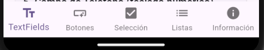
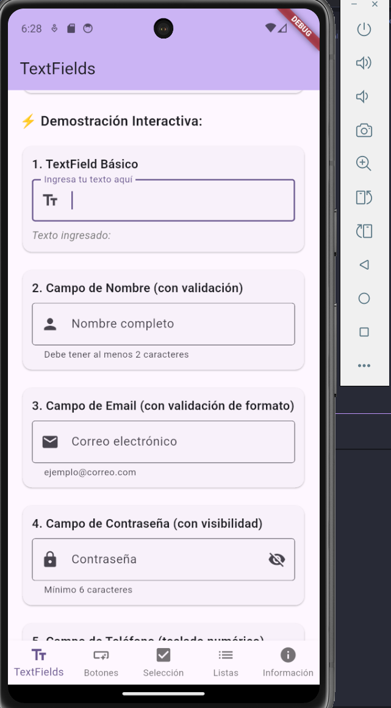
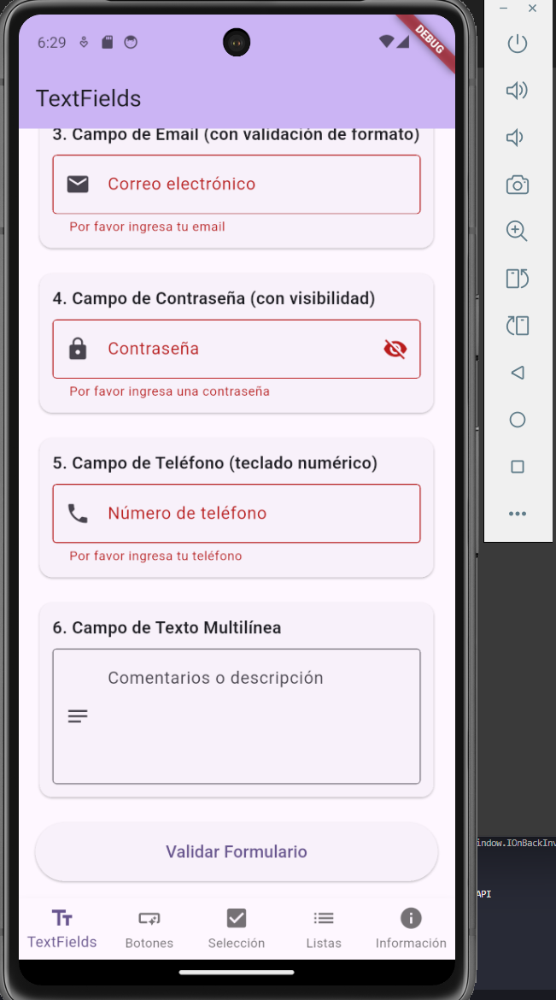
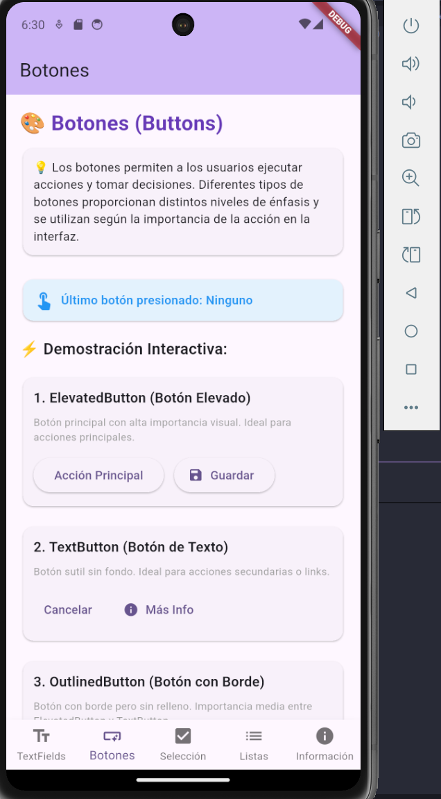
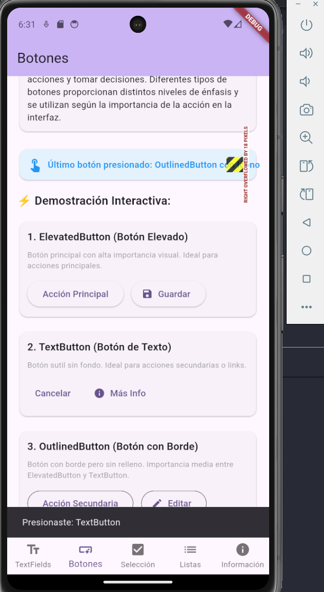
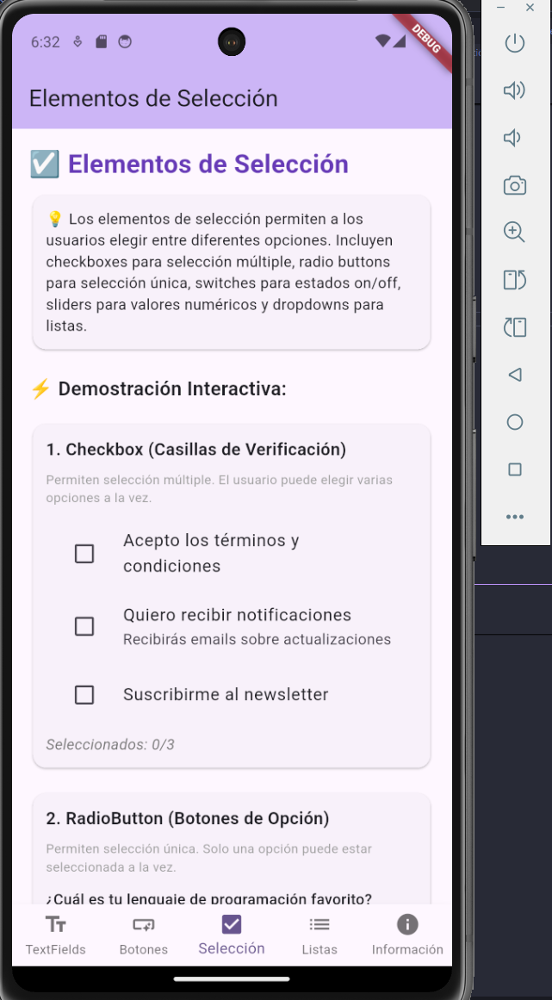
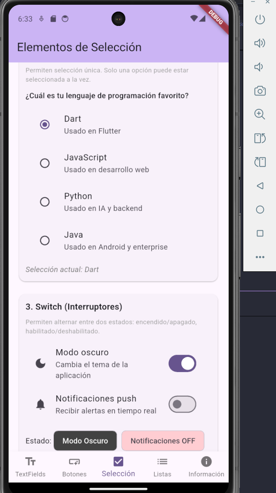
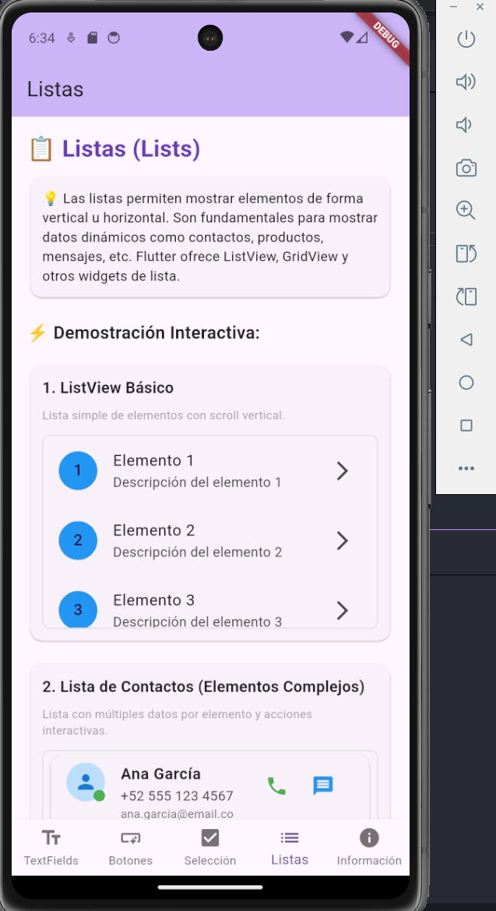
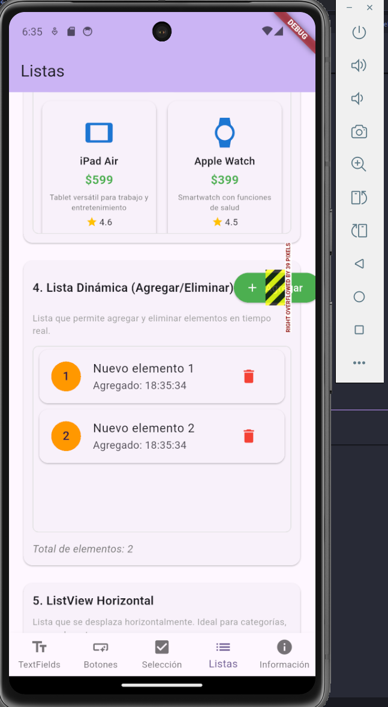
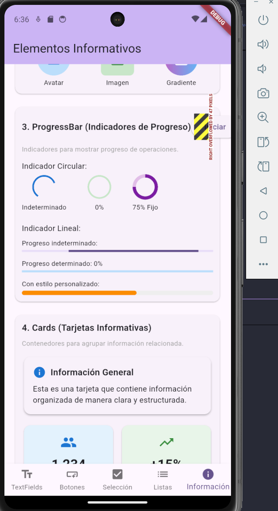

# 📱 UI Elements Demo - Flutter

Una aplicación Flutter educativa que demuestra diferentes elementos de interfaz de usuario, organizados en 5 pantallas principales con ejemplos interactivos y explicaciones detalladas.

## 📋 Descripción del Proyecto

Esta aplicación fue desarrollada como parte de una tarea educativa para mostrar los elementos fundamentales de la interfaz de usuario en Flutter. Cada pantalla se enfoca en una categoría específica de elementos UI, proporcionando ejemplos visuales, explicaciones breves y demostraciones interactivas.

### 🎯 Objetivos del Proyecto

- **Educativo**: Enseñar los elementos básicos de UI en Flutter
- **Interactivo**: Permitir al usuario experimentar con cada elemento
- **Organizado**: Estructura clara y navegación intuitiva
- **Completo**: Cubrir los elementos más importantes de una interfaz móvil

## 📸 Capturas de Pantalla

> **📝 Nota**: Para agregar las capturas de pantalla, consulta el archivo `screenshots/INSTRUCCIONES_CAPTURAS.md` que contiene la guía detallada de qué capturas tomar y cómo tomarlas.

### 🏠 Pantalla Principal y Navegación
<div align="center">
  
</div>

### 📝 TextFields - Campos de Texto
<div align="center">
  
  
</div>

*Ejemplos de campos de texto con validación, diferentes tipos de teclado y funcionalidades interactivas.*

### 🎨 Botones - Elementos de Acción
<div align="center">
  
  
</div>

*Diferentes tipos de botones con estados, estilos personalizados y feedback visual.*

### ☑️ Elementos de Selección
<div align="center">
  
  
</div>

*Checkbox, RadioButton, Switch, Slider y Dropdown con ejemplos prácticos.*

### 📋 Listas - Visualización de Datos
<div align="center">
  
  
</div>

*ListView, GridView, listas dinámicas y elementos complejos con interacciones.*

### ℹ️ Elementos Informativos
<div align="center">
  
  
</div>

*Text, iconos, progress indicators, cards, badges y chips para mostrar información.*

## 🚀 Características Principales

### 📱 Navegación Principal
- **BottomNavigationBar** con 5 pestañas para fácil navegación
- **AppBar** dinámico que muestra el título de la pantalla actual
- **Material Design 3** para una apariencia moderna y consistente

### 📝 Fragment 1: TextFields
- **TextField básico** con detección de cambios en tiempo real
- **TextFormField con validación** para nombres, emails y contraseñas
- **Diferentes tipos de teclado** (email, teléfono, texto)
- **Campo de contraseña** con toggle de visibilidad
- **Texto multilínea** para comentarios largos
- **Validación de formularios** con mensajes de error claros

### 🎨 Fragment 2: Botones
- **ElevatedButton** para acciones principales
- **TextButton** para acciones secundarias
- **OutlinedButton** para importancia media
- **IconButton** para acciones simples
- **FloatingActionButton** (normal y extendido)
- **Botones con estados especiales** (deshabilitado, loading, toggle)
- **Botones personalizados** con colores y formas customizadas

### ☑️ Fragment 3: Elementos de Selección
- **Checkbox** para selección múltiple
- **RadioButton** para selección única
- **Switch** para estados on/off
- **Slider** simple y de rango
- **DropdownButton** con iconos
- **Lista de selección múltiple** con chips visuales

### 📋 Fragment 4: Listas
- **ListView básico** con elementos simples
- **Lista de contactos** con elementos complejos y acciones
- **GridView** para productos en cuadrícula
- **Lista dinámica** con funciones de agregar/eliminar
- **ListView horizontal** tipo carrusel

### ℹ️ Fragment 5: Elementos Informativos
- **Text** con diferentes estilos y formatos
- **Iconos** y avatares con formas variadas
- **Progress Indicators** (circular y lineal, determinado e indeterminado)
- **Cards** informativas con estadísticas
- **Badges y Chips** para etiquetas y estados

## 🛠️ Instrucciones de Instalación

### Prerrequisitos
- **Flutter SDK** (versión 3.9.2 o superior)
- **Dart SDK** (incluido con Flutter)
- **IDE** recomendado: Visual Studio Code con extensión Flutter o Android Studio

### Pasos de Instalación

1. **Clonar el repositorio:**
   ```bash
   git clone https://github.com/tu-usuario/flutter_ui_elements_demo.git
   cd flutter_ui_elements_demo
   ```

2. **Instalar dependencias:**
   ```bash
   flutter pub get
   ```

3. **Verificar configuración de Flutter:**
   ```bash
   flutter doctor
   ```

4. **Ejecutar la aplicación:**
   ```bash
   flutter run
   ```

### Plataformas Compatibles
- ✅ **Android** (API 21+)
- ✅ **iOS** (iOS 12.0+)
- ✅ **Web** (Chrome, Firefox, Safari)
- ✅ **Windows** (Windows 10+)
- ✅ **macOS** (macOS 10.14+)
- ✅ **Linux** (Ubuntu 18.04+)

## 🧪 Cómo Probar la Aplicación

### Navegación
1. **Abrir la aplicación** - Verás la pantalla de TextFields por defecto
2. **Usar la barra inferior** - Toca cualquier ícono para cambiar de pantalla
3. **Explorar cada sección** - Cada pantalla tiene ejemplos interactivos

### Funcionalidades a Probar

#### 📝 TextFields
- Escribe en el campo básico y observa el texto en tiempo real
- Intenta validar el formulario con campos vacíos o inválidos
- Prueba el toggle de visibilidad en el campo de contraseña
- Experimenta con diferentes tipos de teclado

#### 🎨 Botones
- Presiona diferentes tipos de botones y observa los mensajes
- Prueba el contador con los FloatingActionButtons
- Experimenta con el botón toggle de "Me gusta"
- Observa los diferentes estilos y estados

#### ☑️ Elementos de Selección
- Selecciona múltiples opciones con checkboxes
- Prueba que solo una opción se puede seleccionar con radio buttons
- Activa/desactiva los switches y observa los chips de estado
- Ajusta los sliders y observa los valores en tiempo real
- Cambia la selección del dropdown

#### 📋 Listas
- Desplázate por las diferentes listas verticales
- Toca elementos para ver mensajes de interacción
- Agrega y elimina elementos en la lista dinámica
- Desliza horizontalmente en el carrusel de productos
- Toca productos en la cuadrícula

#### ℹ️ Elementos Informativos
- Observa los diferentes estilos de texto
- Presiona "Iniciar" para ver el progreso animado
- Examina las estadísticas en las tarjetas
- Observa los badges y estados con colores

## 🔧 Estructura del Proyecto

```
lib/
├── main.dart                           # Punto de entrada y navegación principal
└── screens/                           # Pantallas de la aplicación
    ├── text_fields_screen.dart        # Fragment 1: TextFields
    ├── buttons_screen.dart             # Fragment 2: Botones
    ├── selection_elements_screen.dart  # Fragment 3: Elementos de selección
    ├── lists_screen.dart              # Fragment 4: Listas
    └── info_elements_screen.dart      # Fragment 5: Elementos informativos
```

### Arquitectura
- **Stateful Widgets** para manejo de estado local
- **Material Design 3** para consistencia visual
- **Responsive Design** que se adapta a diferentes tamaños de pantalla
- **Código modular** con separación clara de responsabilidades

## 🚧 Dificultades Encontradas y Soluciones

### 1. **Manejo de Estado en Múltiples Elementos**
**Problema**: Coordinar el estado de múltiples elementos de UI en una sola pantalla.
**Solución**: Uso de `StatefulWidget` con variables de estado específicas para cada elemento y `setState()` para actualizar la UI.

### 2. **Validación de Formularios**
**Problema**: Implementar validación robusta que sea informativa para el usuario.
**Solución**: Uso de `Form` con `GlobalKey`, `TextFormField` con validadores personalizados y `SnackBar` para feedback visual.

### 3. **Listas Dinámicas Performance**
**Problema**: Mantener rendimiento óptimo en listas que cambian frecuentemente.
**Solución**: Uso de `ListView.builder` para renderizado eficiente y `key` únicos para elementos dinámicos.

### 4. **Navegación Consistente**
**Problema**: Mantener el estado de navegación mientras se cambia entre pantallas.
**Solución**: Implementación de `BottomNavigationBar` con índice de estado compartido.

### 5. **Compatibilidad de API**
**Problema**: Algunas APIs de Flutter han cambiado en versiones recientes.
**Solución**: Uso de las últimas versiones de widgets y manejo de deprecation warnings.

## 🎯 Hallazgos y Aprendizajes

### ✅ Mejores Prácticas Identificadas

1. **Organización del Código**
   - Separar cada pantalla en archivos independientes
   - Usar nombres descriptivos para variables y funciones
   - Agrupar widgets relacionados en Cards para mejor organización visual

2. **Experiencia de Usuario**
   - Proporcionar feedback inmediato para todas las interacciones
   - Usar colores consistentes para estados similares
   - Incluir tooltips y texto de ayuda para elementos no obvios

3. **Manejo de Estado**
   - `StatefulWidget` es ideal para estado local simple
   - Usar controladores para TextFields que requieren manipulación
   - Implementar validación en tiempo real para mejor UX

### 🔍 Insights Técnicos

1. **Flutter Material Design**
   - Material 3 proporciona colores y estilos más modernos
   - Los widgets tienen comportamientos consistentes entre plataformas
   - La personalización es flexible sin perder la consistencia

2. **Performance**
   - `ListView.builder` es crucial para listas largas
   - `const` constructors mejoran el rendimiento cuando es posible
   - Las animaciones suaves mejoran la percepción de rendimiento

3. **Accessibilidad**
   - Los widgets de Material Design incluyen accessibilidad por defecto
   - Labels y tooltips son importantes para usuarios con necesidades especiales

### 📈 Resultados del Proyecto

- ✅ **5 pantallas completas** con ejemplos interactivos
- ✅ **Más de 25 elementos de UI diferentes** implementados
- ✅ **Navegación fluida** entre todas las secciones
- ✅ **Código limpio y documentado** fácil de entender
- ✅ **Experiencia de usuario intuitiva** con feedback visual consistente

## 📚 Tecnologías Utilizadas

- **Flutter** 3.9.2 - Framework de UI multiplataforma
- **Dart** - Lenguaje de programación
- **Material Design 3** - Sistema de diseño de Google
- **Cupertino Icons** - Iconografía de iOS

## 👥 Contribuciones

Este proyecto fue desarrollado como una tarea educativa individual, pero está abierto a mejoras y sugerencias. Si encuentras algún problema o tienes ideas para nuevas funcionalidades, no dudes en abrir un issue o enviar un pull request.

## 📄 Licencia

Este proyecto está bajo la Licencia MIT. Ver el archivo `LICENSE` para más detalles.

---

**Desarrollado con ❤️ usando Flutter**

*Proyecto educativo para demostrar elementos de UI en Flutter*
